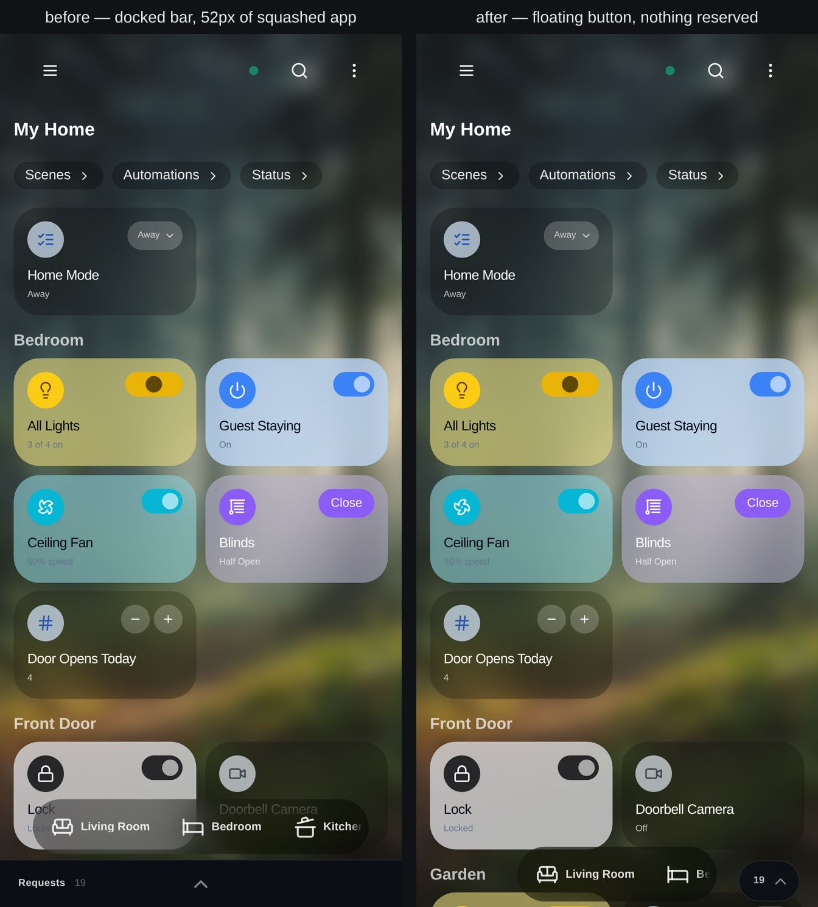
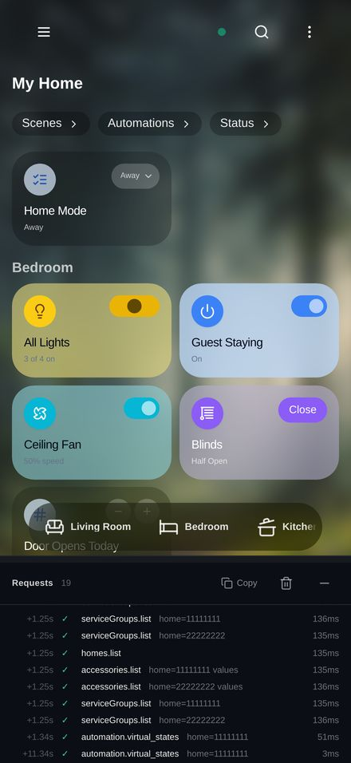

# The minimised request log — docked bar vs. floating button

Evidence for parob/homecast-cloud#122, which asked for the collapsed request
log to be a button in the bottom-right on the tab bar's alignment, with minimal
visual impact and no insets.

Committed, unlike the captures in the gitignored `output/`, because the whole
substance of the change is what the bottom of the screen looks like, and only
images served from a GitHub host embed in a pull request.

Both halves have the log switched on, five pins in the tab bar, and 19 recorded
requests, so the bar is at the widest the change has to cope with.

## Minimised — before (left), after (right)

## Expanded — unchanged

It still docks, still squashes the app, still resizes. Only the collapsed state
moved.

## The numbers under the picture

Measured in Chromium at 440×956, the viewport the report came from:

| | before | after |
|---|---|---|
| App height, minimised | 904 | **956** — not squashed |
| Tab bar `bottom` | 52px | **0px** — back on the bottom edge |
| Collapsed control | 400 × 51, flush to the bottom edge | **67 × 45**, 6px up and 20px in |
| Its gutter vs. the tab bar's | n/a | **20px both** — the same computed gutter |
| Overlaps the tab pill | no (it was below it) | no (the rail holds the pill clear) |

The cost is in the last row: the pill's ceiling comes down from 368px to 218px
while the log is minimised, so a bar with this many pins scrolls rather than
fitting. That is deliberate — see the rail in `src/lib/debug-dock.ts`.

## Regenerating

`screenshots/request-log-minimised.spec.ts` captures one side at a time,
labelled by `REQUEST_LOG_LABEL`, into the gitignored `output/request-log/`:

    REQUEST_LOG_LABEL=before npx playwright test request-log-minimised.spec.ts --project=iphone-screenshots   # from origin/main
    REQUEST_LOG_LABEL=after  npx playwright test request-log-minimised.spec.ts --project=iphone-screenshots   # from this branch

The spec's second test asserts the "after" numbers above, and fails on `main`.
The sheets here were composed from the two halves.
