# Three asks from one report

Evidence for parob/homecast-cloud#157. Committed, unlike the captures in the
gitignored `output/`, because two of the three changes are "does this look
better" and that has to show the picture *in the pull request*.

Every capture is the real dashboard driven by Playwright — the phone ones at
440 × 956 with the reporter's own iPhone user agent, the desktop ones at the
window width in the filename. `before` is `origin/main`, `after` is this branch.

## 1. The colour Safari's bars take

The page canvas — what iOS 26 Safari tints its status-bar and URL-bar glass
with, and what the wallpaper fades into at both its edges — was sampled from
the wallpaper's top 5%. Three wallpapers, chosen to put that rule under
different inputs; `../../fixtures/make-wallpapers.mjs` builds them.

### The reported fault — bright sky over a dark facade

Built to the measurements of the reporter's screenshot: a sky band averaging
`#91abd9` over a body of `#5a5a55`. The top 5% is sky, so the bands took the
sky and nothing else about the picture got a vote.

| | |
|---|---|
| 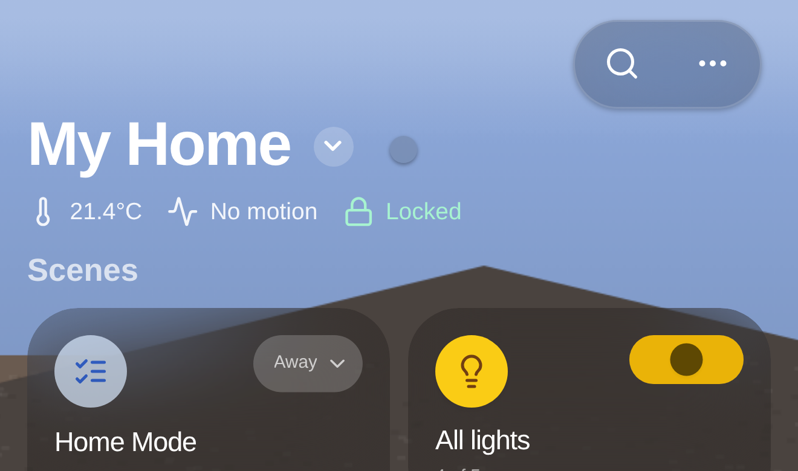 | 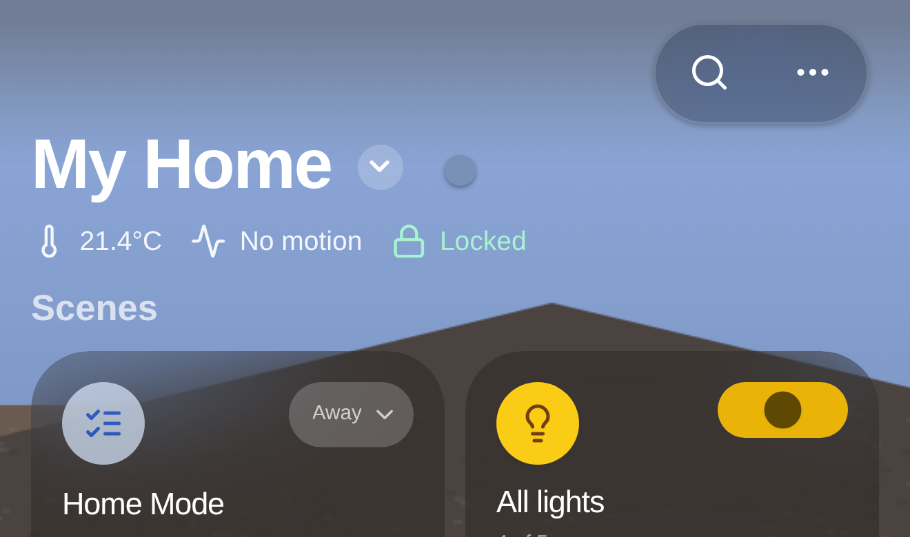 |
| 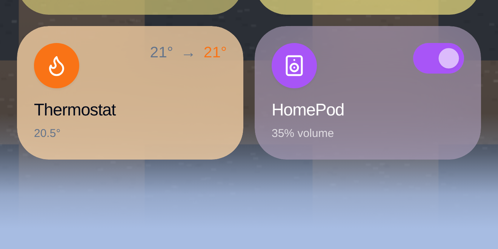 | 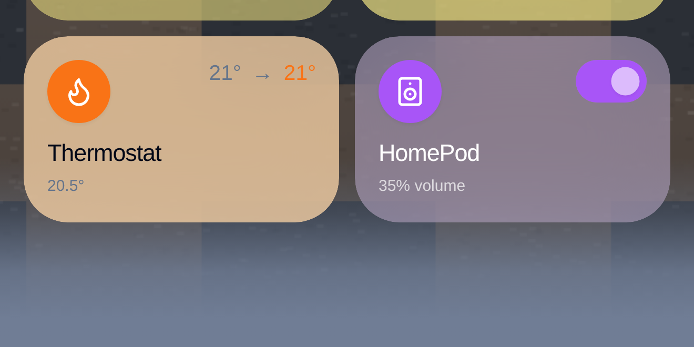 |

Left is `origin/main`, right is this branch; top row is the status-bar end,
bottom row is the end of the page where the scrim reaches the canvas colour
outright — the band Safari draws its URL bar over.

### The control — an evenly lit room

Edge and average already agree, so there is nothing to correct and the rule
must be close to inert. It is: the band moves by seven points of luminance.

| | |
|---|---|
| 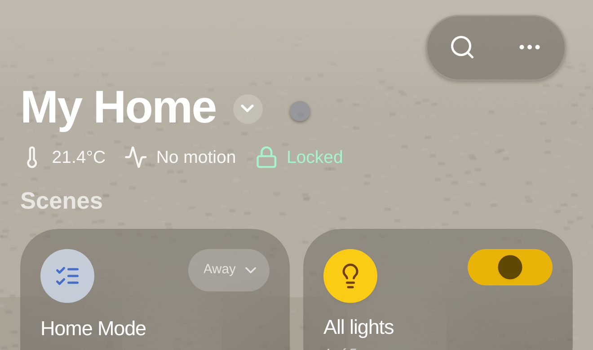 | 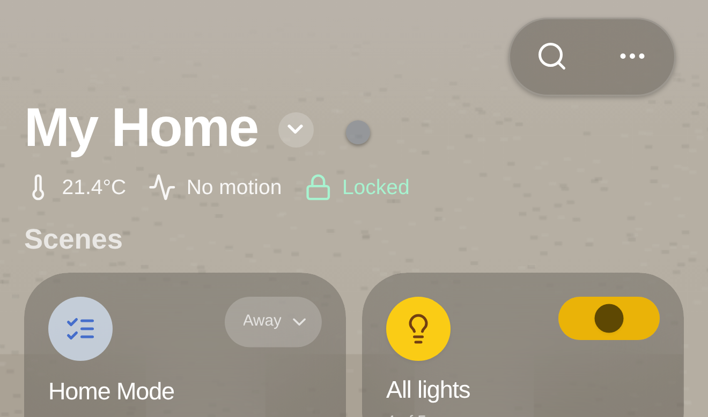 |

### The awkward one — dusk over lit water

A dark sky at the top, bright water at the foot. This is the same bug in the
other direction, and it was never reported: the old rule took the dark sky and
laid a near-black bar under a warm sunset, at **0.60×** the picture's
luminance. One colour has to serve both ends, so neither edge can own it.

| | |
|---|---|
| 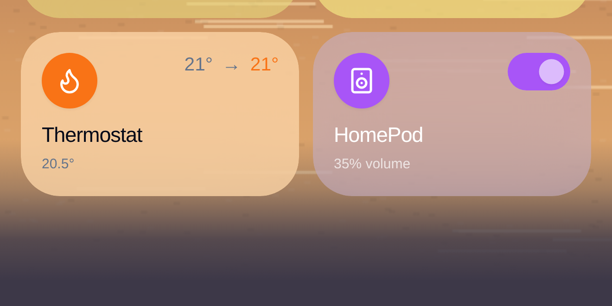 | 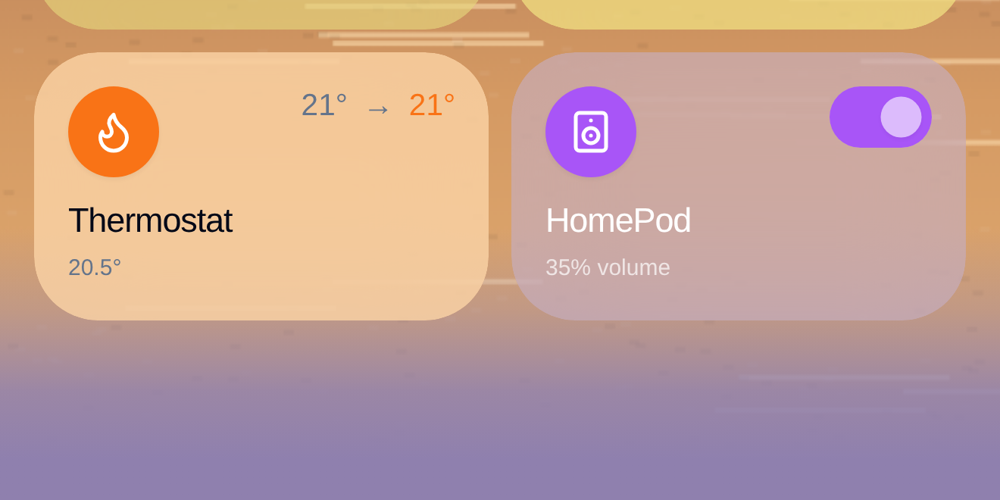 |

### The numbers

Luminance, 0–255. "Edge" is the top 5% the sampler reads; "picture" is the
whole-image average the band is now matched to.

| Wallpaper | Edge | Picture | Band before | Band after | Ratio before | Ratio after |
|---|---|---|---|---|---|---|
| Reporter's own screenshot | — | 89.6 | 168.8 | — | **1.90×** | — |
| `sky-over-dark-house` | 176.6 | 93.0 | 186.3 | 124.0 | **2.00×** | **1.33×** |
| `even-daylight-room` | 176.7 | 168.6 | 185.8 | 178.8 | 1.10× | 1.06× |
| `dusk-over-water` | 31.3 | 97.5 | 58.2 | 134.5 | **0.60×** | **1.38×** |

Not 1.00×: `SAMPLED_TINT_LIFT` still nudges the band towards white afterwards
so it does not read as a shadow against the wallpaper it borders.

## 2. The way back, on a phone

| `origin/main` | This branch |
|---|---|
| 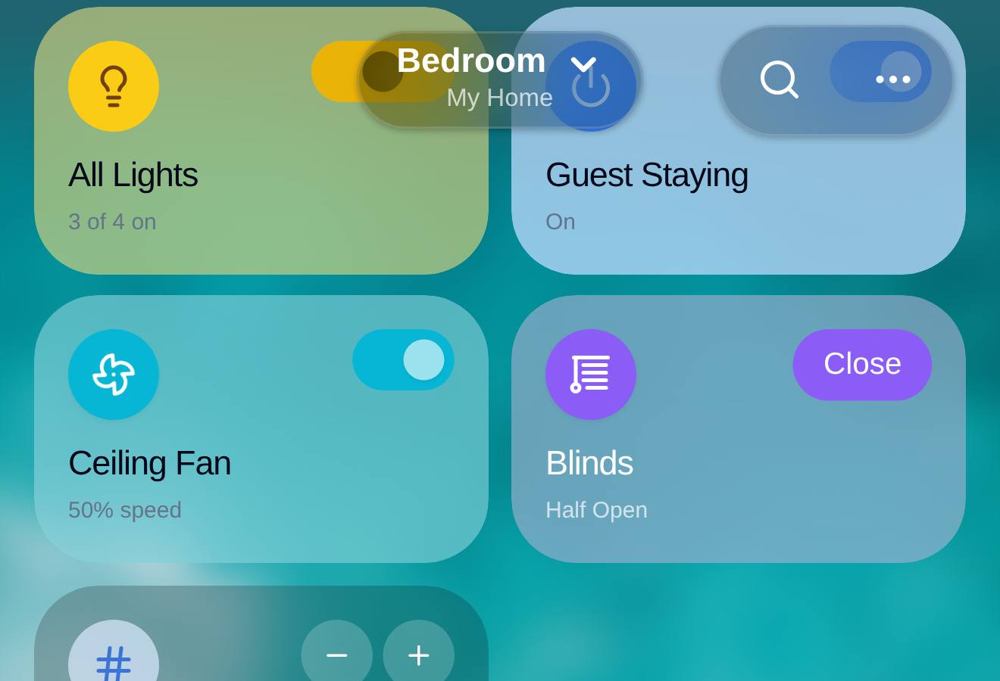 | 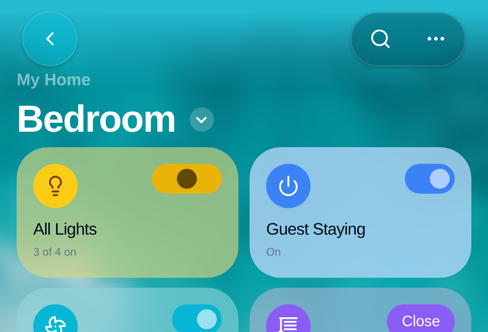 |

The first attempt at this put a chevron on the path line above the room name
and was told it was not the native look. It was not:
`NativeHeaderBar.swift` sets `backButtonDisplayMode = .minimal`, which draws a
chevron **alone in the navigation bar**, leading edge, opposite the trailing
controls — the page's own path line stays plain text. So the glyph is in the
bar now and the crumb is a crumb again.

It wears the same glass capsule as its neighbours rather than sitting bare:
UIKit can afford a bare glyph on opaque chrome, and this row is transparent
over a photograph.

## 3. The navigation panel on a wide screen

It was a flat 248px at every window width.

| `origin/main`, 1920 | This branch, 1600 | This branch, 1920 |
|---|---|---|
| 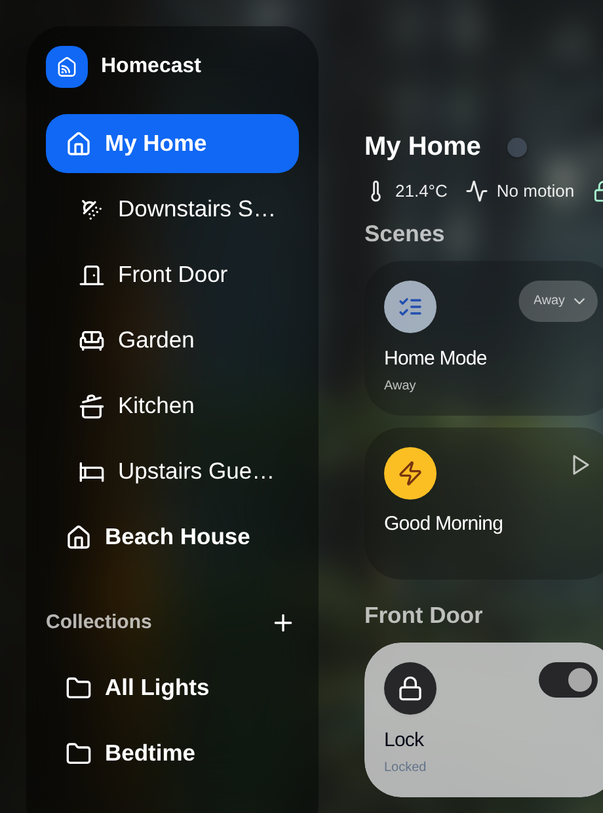 | 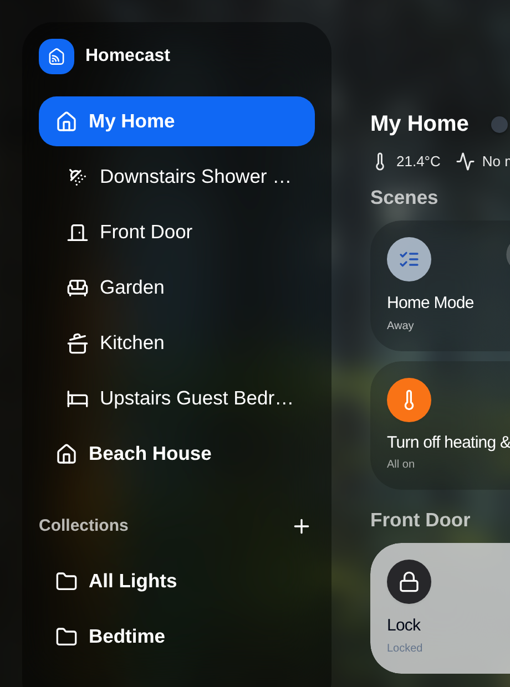 | 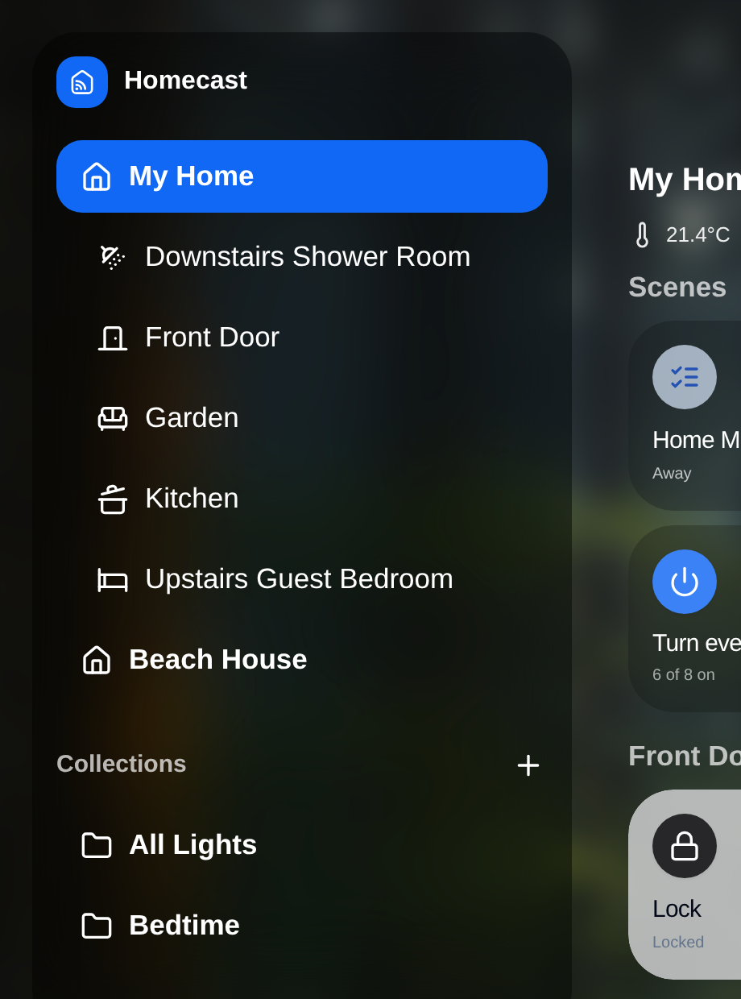 |

| Window | Before | After | Names clipped, after |
|---|---|---|---|
| 1280 | 248 | 248 | both |
| 1600 | 248 | 304 | both |
| 1920 | 248 | 360 | none |
| 2560 | 248 | 360 | none |

1280 is deliberately unchanged — below that the grid cannot spare the width.
360 is measured rather than chosen: a row spends about 125px of the panel on
the inset, padding, icon and trailing control, and at 320px a 22-character
room name was still seven pixels short of fitting.

## Regenerating

    npx playwright test wallpaper-edge-colour.spec.ts sidebar-width.spec.ts \
      phone-back-button.spec.ts --project=screenshots

Seven tests. Against `origin/main`, four fail: the missing back button, the
panel that never widens, and both ends of the colour rule — `sky-over-dark-house`
at 2.00× and `dusk-over-water` at 0.60×. The three that pass on both sides are
the ones asserting what must *not* change: the control wallpaper, the plain
path line, and a desktop that grows no back button.

Prefix `EDGE_COLOUR_LABEL=before SIDEBAR_LABEL=before BACK_CRUMB_LABEL=before`
to file the other side.
